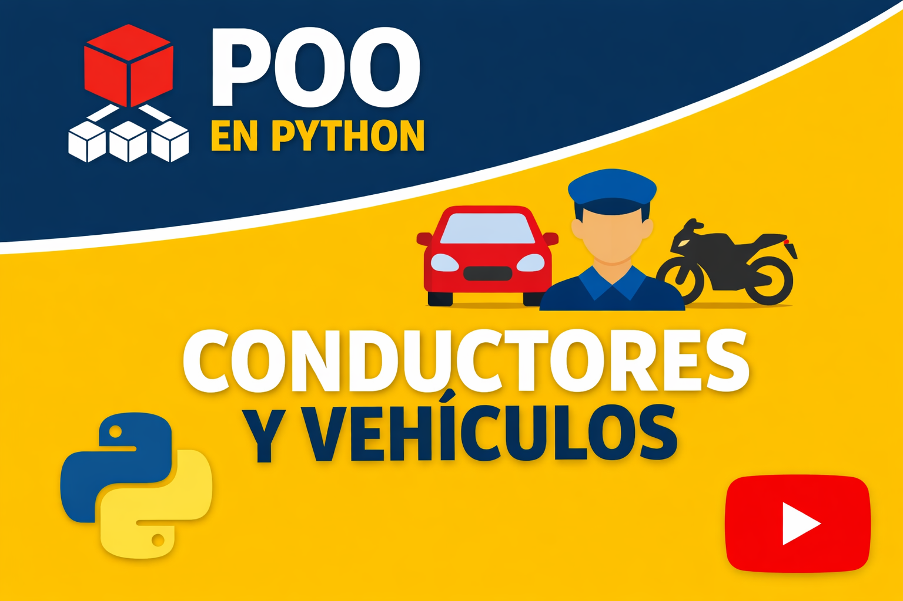

# 🚗 Sistema de Gestión de Vehículos y Conductores  
**Transporte Seguro S.A.**

## 📌 Descripción del Proyecto
Este proyecto modela un **sistema básico de gestión de vehículos y conductores** para la empresa *Transporte Seguro S.A.*, aplicando **Programación Orientada a Objetos (POO)** en Python.

El sistema permite registrar conductores, crear distintos tipos de vehículos y aplicar **reglas de negocio específicas** según el tipo de vehículo, haciendo uso de **abstracción, herencia, polimorfismo, composición y agregación**.

---

## 🎯 Objetivos
- Aplicar correctamente los principios de **POO**
- Modelar un problema del mundo real
- Diferenciar comportamientos según el tipo de vehículo
- Practicar diseño limpio y reutilizable

---

## 🧩 Conceptos de POO Aplicados
- **Abstracción** → Clase abstracta `Vehiculo`
- **Herencia** → `Moto`, `Carro`, `Camion`
- **Polimorfismo** → Método `iniciar_jornada()`
- **Encapsulación** → Atributos protegidos
- **Composición** → Cada vehículo tiene un `Motor`
- **Agregación** → Un vehículo puede existir sin conductor
- **Interfaces** → `Movible` con método `mover()`

---

## 🚘 Tipos de Vehículos y Reglas de Negocio

| Vehículo | Regla Especial |
|--------|---------------|
| Moto | Requiere casco obligatorio |
| Carro | Revisión técnico-mecánica vigente |
| Camión | Planilla de carga y peso máximo permitido |

---

## 👤 Conductores
Cada conductor cuenta con:
- Nombre
- Documento
- Licencia válida

Un conductor puede ser asignado o retirado de un vehículo sin afectar su existencia.

---

## 🗂️ Estructura del Proyecto
models/
- conductor.py
- Motor.py
- Movible.py
- TipoVehiculos.py
- Vehiculo.py
- VehiculosDisponibles.py

services/
- JornadaService.py

main.py

README.md


---

## ▶️ Ejecución del Proyecto
Desde la terminal, ubicándose en la carpeta del proyecto:

```bash
python main.py

```

## 🎥 Video Explicativo del Proyecto

En el siguiente video se explica de manera breve y clara el funcionamiento del sistema, la estructura del proyecto y los conceptos de Programación Orientada a Objetos aplicados, como abstracción, herencia, polimorfismo, composición y agregación.

[](https://youtu.be/DMdGOXdueQI)

👉 **Enlace directo al video:**  
https://youtu.be/DMdGOXdueQI


